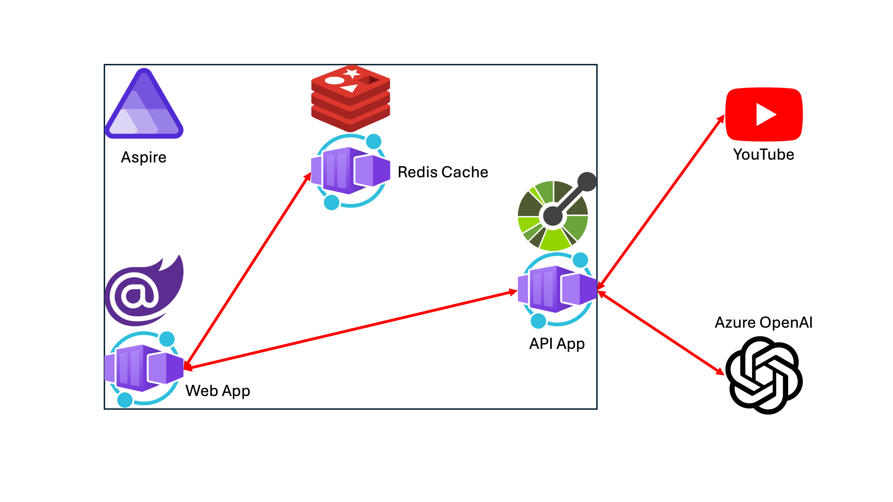

# 세션 03: Java 기반 Spring Boot 앱 이전

이 세션에서는 [GitHub Copilot](https://docs.github.com/ko/copilot/overview-of-github-copilot/about-github-copilot-business) 기능을 활용해 빠르게 [ASP.NET Core 백엔드 API 앱](https://learn.microsoft.com/ko-kr/aspnet/core/fundamentals/apis?WT.mc_id=dotnet-121695-juyoo)을 Java 기반의 Spring Boot 앱으로 이전해 보겠습니다.

> [GitHub Codespaces](https://docs.github.com/ko/codespaces/overview) 또는 [Visual Studio Code](https://code.visualstudio.com/?WT.mc_id=dotnet-121695-juyoo) 환경에서 작업하는 것을 기준으로 합니다. 또한 [Microsoft OpenJDK 17+](https://learn.microsoft.com/ko-kr/java/openjdk/download?WT.mc_id=dotnet-121695-juyoo)와 [Spring Boot CLI](https://docs.spring.io/spring-boot/installing.html#getting-started.installing.cli)를 설치했다고 가정합니다.

<!--  -->

## 03-1: Spring Boot 프로젝트 생성하기

1. 터미널을 열고 아래 명령어를 차례로 실행시켜 리포지토리의 루트 디렉토리로 이동합니다.

    ```bash
    # GitHub Codespaces
    REPOSITORY_ROOT=$CODESPACE_VSCODE_FOLDER
    cd $REPOSITORY_ROOT

    # bash/zsh
    REPOSITORY_ROOT=$(git rev-parse --show-toplevel)
    cd $REPOSITORY_ROOT

    # PowerShell
    $REPOSITORY_ROOT = git rev-parse --show-toplevel
    cd $REPOSITORY_ROOT
    ```

> 세이브 포인트에서 가져온 프로젝트를 사용하려면 아래 명령어를 차례로 실행시켜 프로젝트를 복원합니다.
> 
> ```bash
> # bash/zsh
> mkdir -p workshop && cp -a save-points/session-02/. workshop/
> cd workshop
> dotnet restore && dotnet build
> 
> # PowerShell
> New-Item -Type Directory -Path workshop -Force && Copy-Item -Path ./save-points/session-02/* -Destination ./workshop -Recurse -Force
> cd workshop
> dotnet restore && dotnet build
> ```

1. 아래 명령어를 차례로 실행시켜 Spring Boot 프로젝트를 생성합니다.

    ```bash
    # bash/zsh
    cd $REPOSITORY_ROOT/workshop
    spring init \
        --type=maven-project \
        --dependencies=web \
        --java-version=17 \
        --group-id summariser.youtube \
        --artifact-id youtubesummariser \
        --name YouTubeSummariser \
        AspireYouTubeSummariser-SpringApp
    mv AspireYouTubeSummariser-SpringApp AspireYouTubeSummariser.SpringApp

    # PowerShell
    cd $REPOSITORY_ROOT/workshop
    spring init `
        --type=maven-project `
        --dependencies=web `
        --java-version=17 `
        --group-id summariser.youtube `
        --artifact-id youtubesummariser `
        --name YouTubeSummariser `
        AspireYouTubeSummariser-SpringApp
    Rename-Item -Path AspireYouTubeSummariser-SpringApp -NewName AspireYouTubeSummariser.SpringApp
    ```

1. 아래 명령어를 실행시켜 방금 생성한 Spring Boot 앱이 제대로 작동하는지 확인합니다.

    ```bash
    cd $REPOSITORY_ROOT/workshop/AspireYouTubeSummariser.SpringApp
    ./mvnw clean package spring-boot:run
    ```

1. 웹 브라우저를 열고 `http://localhost:8080`으로 접속해서 초기 화면이 나오는 것을 확인합니다.
1. 터미널 창에서 `CTRL`+`C` 키를 눌러 Spring Boot 앱 실행을 중지합니다.

## 03-2: ASP.NET Core Web API 앱을 Spring Boot 앱으로 이전하기

1. `pom.xml` 파일을 열고 GitHub Copilot Chat을 열어 아래와 같이 입력하여 OpenAPI 라이브러리를 추가합니다.

    ```bash
    @workspace /fix Add springdoc openapi to pom.xml
    ```

   그러면 아래와 비슷한 XML 문서를 자동으로 만들어 줄 것입니다. 아래 코드를 참고해서 `pom.xml` 파일을 수정합니다.

    ```xml
    <dependency>
        <groupId>org.springdoc</groupId>
        <artifactId>springdoc-openapi-starter-webmvc-ui</artifactId>
        <version>2.5.0</version>
    </dependency>
    ```

1. `AspireYouTubeSummariser.ApiApp` 프로젝트의 `Program.cs` 파일을 열고 전체 내용을 선택합니다. GitHub Copilot Chat을 열어 아래와 입력하여 Spring Boot 앱 형식의 컨트롤러와 서비스, 모델 등으로 변경합니다.

    ```bash
    @workspace /fix Convert this C# code to Spring Boot code by splitting into controllers, services and models
    ```

   그러면 Java 코드를 순차적으로 만들어 줄 것입니다. 하나씩 참고해서 Java 코드를 작성합니다.

1. `models/WeatherForecast.java`

    ```java
    package main.java.summariser.youtube.youtubesummariser.models;
    
    import java.time.LocalDate;
    
    public class WeatherForecast {
        private LocalDate date;
        private int temperatureC;
        private String summary;
    
        // Constructor, Getters, and Setters
    }
    ```

   만약 위와 같이 생성자, 게터, 세터 등을 만들어 주지 않는다면, 위의 `// Constructor, Getters, and Setters` 아래에서 `CTRL`+`I` 키 또는 `CMD`+`I` 키를 눌러 GitHub Copilot Chat 창을 활성화 시킵니다. 그리고 아래 프롬프트를 입력합니다.

    ```text
    Add getters and setters for the fields of the WeatherForecast class.
    ```

   그러면 아래와 비슷한 코드를 자동으로 만들어 줄 것입니다. 아래 코드를 참고해서 `WeatherForecast.java` 파일을 수정합니다.

    ```java
    // Constructor
    public WeatherForecast(LocalDate date, int temperatureC, String summary) {
        this.date = date;
        this.temperatureC = temperatureC;
        this.summary = summary;
    }
    
    // Getters and Setters
    public LocalDate getDate() {
        return date;
    }
    
    public void setDate(LocalDate date) {
        this.date = date;
    }
    
    public int getTemperatureC() {
        return temperatureC;
    }
    
    public void setTemperatureC(int temperatureC) {
        this.temperatureC = temperatureC;
    }
    
    public String getSummary() {
        return summary;
    }
    
    public void setSummary(String summary) {
        this.summary = summary;
    }
    ```

1. `controllers/WeatherForecastController.java`

    ```java
    package main.java.summariser.youtube.youtubesummariser.controllers;
    
    import org.springframework.web.bind.annotation.GetMapping;
    import org.springframework.web.bind.annotation.RestController;
    import java.util.List;
    
    @RestController
    public class WeatherForecastController {
    
        @GetMapping("/weatherforecast")
        public WeatherForecast[] getWeatherForecast() {
            // Implement the logic to return weather forecast
            return List.of(); // Placeholder
        }
    }
    ```

   GitHub Copilot이 위와 같이 자동으로 만들어 줬다면, 아직 `/weatherforecast` 엔드포인트를 구현해 주지 않은 상태입니다. 이 경우, `AspireYouTubeSummariser.ApiApp` 프로젝트의 `Program.cs` 파일에서 아래 영역을 선택합니다.

    ```csharp
    var summaries = new[]
    {
        "Freezing", "Bracing", "Chilly", "Cool", "Mild", "Warm", "Balmy", "Hot", "Sweltering", "Scorching"
    };
    
    app.MapGet("/weatherforecast", () =>
    {
        var forecast =  Enumerable.Range(1, 5).Select(index =>
            new WeatherForecast
            (
                DateOnly.FromDateTime(DateTime.Now.AddDays(index)),
                Random.Shared.Next(-20, 55),
                summaries[Random.Shared.Next(summaries.Length)]
            ))
            .ToArray();
        return forecast;
    })
    .WithName("GetWeatherForecast")
    .WithOpenApi();
    ```

   이후 `Program.cs` 파일 탭을 열어둔 채로 GitHub Copilot Chat을 열어 아래와 같이 프롬프트를 입력해서 Java 코드로 변경합니다.

    ```text
    @workspace /fix Convert this C# code into Java code
    ```

   그러면 자동으로 아래와 같은 Java 코드를 생성해 줍니다. 상황에 맞게 Java 코드를 수정합니다.

    ```java
    package main.java.summariser.youtube.youtubesummariser.controllers;
    
    import org.springframework.http.MediaType;
    import org.springframework.web.bind.annotation.GetMapping;
    import org.springframework.web.bind.annotation.RequestMapping;
    import org.springframework.web.bind.annotation.RestController;
    
    import main.java.summariser.youtube.youtubesummariser.models.WeatherForecast;
    
    import java.time.LocalDate;
    import java.util.List;
    import java.util.Random;
    import java.util.stream.IntStream;
    
    @RequestMapping(value = "/api")
    @RestController
    public class WeatherForecastController {
    
        private static final String[] summaries = {
            "Freezing", "Bracing", "Chilly", "Cool", "Mild", "Warm", "Balmy", "Hot", "Sweltering", "Scorching"
        };
    
        @GetMapping(value = "/weatherforecast", produces = MediaType.APPLICATION_JSON_VALUE)
        public WeatherForecast[] getWeatherForecast() {
            Random random = new Random();
            return IntStream.range(1, 6)
                    .mapToObj(i -> new WeatherForecast(
                            LocalDate.now().plusDays(i),
                            random.nextInt(75) - 20,
                            summaries[random.nextInt(summaries.length)]))
                    .toArray(WeatherForecast[]::new);
        }
    }
    ```

1. `controllers/HomeController.java`

   GitHub Copilot Chat을 통해 아래와 같이 입력하여 `HomeController.java` 파일을 생성합니다.

    ```text
    @workspace /fix Create a HomeController class with a method to redirect to the Swagger UI page
    ```

   그러면 자동으로 아래와 같이 Java 코드를 생성해 줍니다. 상황에 맞게 수정합니다.

    ```java
    package main.java.summariser.youtube.youtubesummariser.controllers;
    
    import org.springframework.stereotype.Controller;
    import org.springframework.web.bind.annotation.GetMapping;
    
    @Controller
    public class HomeController {
    
        @GetMapping("/")
        public String redirectSwaggerUi() {
            return "redirect:/swagger-ui.html";
        }
    }
    ```

1. `YouTubeSummariserApplication.java` 파일을 열어, 아래 코드가 있는지 확인하고 없으면 추가합니다.

```java
package summariser.youtube.youtubesummariser;

import org.springframework.boot.SpringApplication;
import org.springframework.boot.autoconfigure.SpringBootApplication;

// ⬇️⬇️⬇️ 코드가 없으면 추가합니다. ⬇️⬇️⬇️
import org.springframework.context.annotation.ComponentScan;
// ⬆️⬆️⬆️ 코드가 없으면 추가합니다. ⬆️⬆️⬆️

@SpringBootApplication
// ⬇️⬇️⬇️ 코드가 없으면 추가합니다. ⬇️⬇️⬇️
@ComponentScan({"main.java.summariser.youtube.youtubesummariser.controllers"})
// ⬆️⬆️⬆️ 코드가 없으면 추가합니다. ⬆️⬆️⬆️
public class YouTubeSummariserApplication {

    public static void main(String[] args) {
        SpringApplication.run(YouTubeSummariserApplication.class, args);
    }

}
```

1. 아래 명령어를 차례로 실행시켜 Spring Boot 앱을 빌드하고 실행시킵니다.

    ```bash
    cd $REPOSITORY_ROOT/workshop/AspireYouTubeSummariser.SpringApp
    ./mvnw clean package spring-boot:run
    ```

1. 웹 브라우저를 열고 `http://localhost:8080`으로 접속해서 Swagger UI 화면이 나오는 것을 확인합니다.
1. 터미널 창에서 `CTRL`+`C` 키를 눌러 Spring Boot 앱 실행을 중지합니다.

## 03-3: 숙제

- ASP.NET Core Web API에 있는 `/summarise` 엔드포인트를 GitHub Copilot을 이용해서 Spring Boot 앱으로 이전해 보세요.

  > **NOTE**: [Java용 Azure OpenAI SDK](https://learn.microsoft.com/ko-kr/java/api/overview/azure/ai-openai-readme?WT.mc_id=dotnet-121695-juyoo)가 필요할 수 있습니다.

- 앞서 만들었던 Blazor 웹 앱의 백엔드를 이 Spring Boot 앱으로 변경한 후 제대로 작동하는지 확인해 보세요.

---

축하합니다! 기존 ASP.NET Core Web API 앱을 Spring Boot 앱으로 이전하는 작업이 끝났습니다. 이제 [Session 04: 셸 스크립트 작업](./04-shell-scripts.md)으로 넘어가세요.
